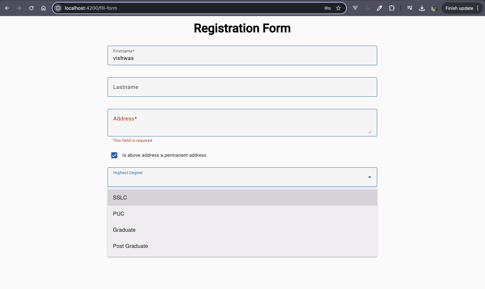

# Form Builder using drag and drop of input fields

This project helps us to generate a dynamic form. Drag and drop the input fields to generate form

This project was generated using [Angular CLI](https://github.com/angular/angular-cli) version 19.2.4.

# Deployed Link of application

You can access the deployed application at [drag-drop-form](https://drag-drop-forms.web.app) 🚀

# Design Docs

You can find the design documents in the [attached-docs](https://github.com/vishwasprabhu98/drag-drop-form/tree/main/attached-docs) folder with the respective filenames.

- [Application Document](https://github.com/vishwasprabhu98/drag-drop-form/blob/main/attached-docs/drag-drop-form.pdf)

# Screenshots

#### Screen Recording

[link](https://github.com/vishwasprabhu98/drag-drop-form/blob/main/attached-docs/drag-drop-record.mov)


#### Build Form UI


#### Edit Form fields


#### Filling the form 



## Development server

To start a local development server, run:

```bash
ng serve
```

Once the server is running, open your browser and navigate to `http://localhost:4200/`. The application will automatically reload whenever you modify any of the source files.

## Code scaffolding

Angular CLI includes powerful code scaffolding tools. To generate a new component, run:

```bash
ng generate component component-name
```

For a complete list of available schematics (such as `components`, `directives`, or `pipes`), run:

```bash
ng generate --help
```

## Building

To build the project run:

```bash
ng build
```

This will compile your project and store the build artifacts in the `dist/` directory. By default, the production build optimizes your application for performance and speed.
